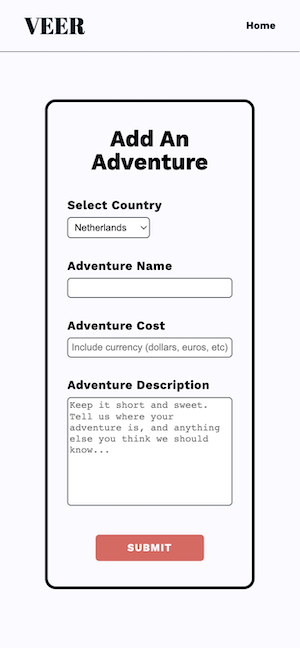

 VEER
 ======

**Use the app:** veerproject.herokuapp.com/ 

**Learn more about the developer:** www.linkedin.com/in/cameron-miner-professional/

Mainstream tourist attractions are overrated. VEER is a full-stack web app that helps you find unique and cultural adventures to do on your next trip abroad.

Users can find random adventures by clicking on the country of their choice. A modal window displays the name of the adventure, cost and any pertinent information needed to find or do the adventure. Anyone can add an adventure to VEER - just click Add My Adventure in the upper righthand corner and fill out the Add An Adventure form. A postgreSQL database houses the adventures, and returns a random adventure each time a user clicks on a country on the homepage.

#### Tech Stack

* JavaScript
* NodeJS
* Express
* PostgreSQL
* HTML/CSS

#### Version 2.0

##### Secure Login
Users can login to VEER, where they will have the option to submit adventures & view/delete their submitted adventures. The "delete" button will no longer display on the homepage, and the Add My Adventure form will be integrated into each individual user's dashboard.

##### Save Adventures
Uses can save their favorite adventures, and view those adventures on their personal dashboard.